<p align="center">
</p>

</p>
   <p align="center">
      <a href="https://github.com/U7P4L-IN/FB-TOOLSBOX/stargazers">
      </a>
      <a href="https://github.com/U7P4L-IN/FB-TOOLSBOX/releases/latest">
      </a>
      <a href="https://www.conventionalcommits.org/en/v1.0.0/">
      </a>
      <a href="https://github.com/U7P4L-IN/FB-TOOLSBOX/actions/workflows/github-action.yml">
      </a>
   </p>
   
</br>

> Facebook Profile Tools Box refers to customize your profile features and control your profile Just Log in your FB Cookie.

## Features

- Change Profile Picture
- Change Profile Cover
- Change Profile Bio
- Change Profile City
- Add Profile Guard
- Change Profile Website
- Lock Your Profile

## Requirements - 
- Stable Internet Connection
- Termux Version Upto Date
- Android 7 or higher
- No Root
- No Termux Knowlegde

<h4 align="left">TESTED ON > </h4>

* Kali Linux
* Termux
* Mac os
* Ubuntu
* Perrot Sec OS

## Installation

Make sure you have the following prerequisites installed on your system:

- [git](https://git-scm.com/)
- [python](https://www.python.org/)
- [pip](https://pypi.org/project/pip/)

 ##### Use the following commands to install the necessary dependencies:

```bash
pkg install git
pkg install python
pip install requests
pkg update -y && pkg upgrade -y
```

<h4 align="left">INSTALL TOOL ON TERMUX > </h4>
 
```python
rm -rf FB-TOOLSBOX
```
* Clone the repository from GitHub:
```
git clone --depth=1 https://github.com/U7P4L-IN/FB-TOOLSBOX.git
```
* Navigate to the FB-TOOLSBOX directory:

```
cd FB-TOOLSBOX
```
* Run the script:

```
python fb.py
```

<p align="center">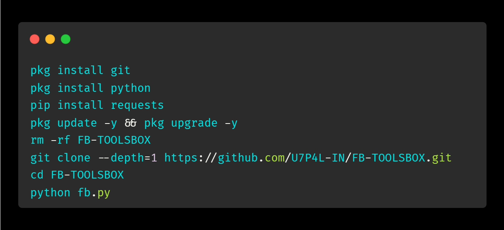

<h5 align="center"><b>TERMUX</b></h5>

## Menu >
<p align="center">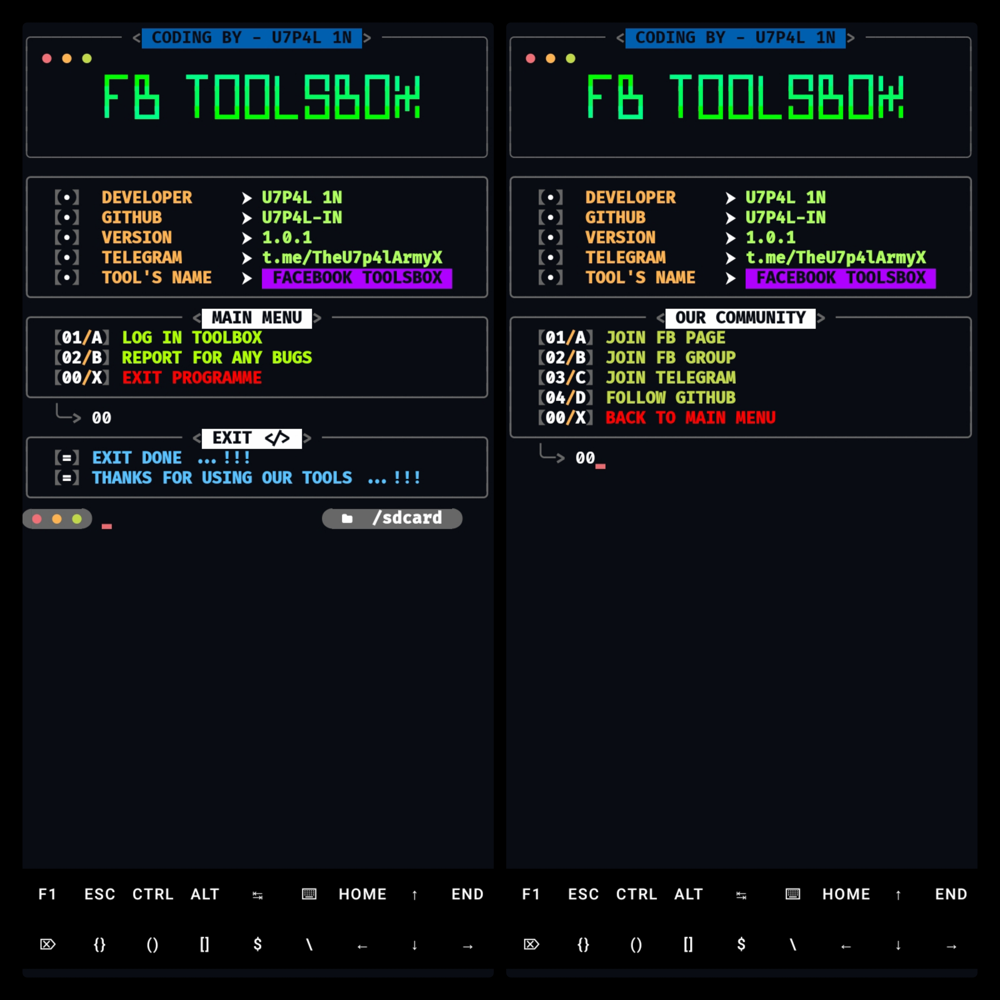

## Cookie log in and Feature >
<p align="center";>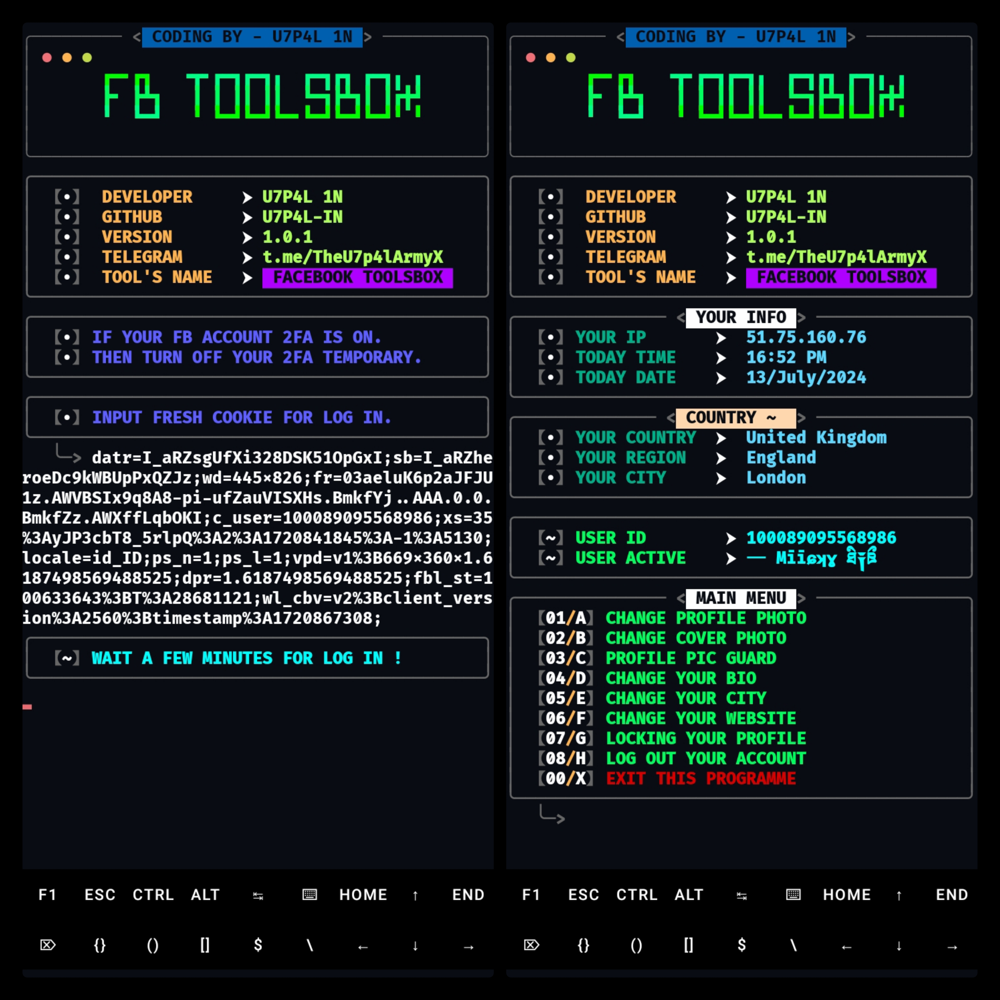

## Change Profile Picture and Cover >
<p align="center";>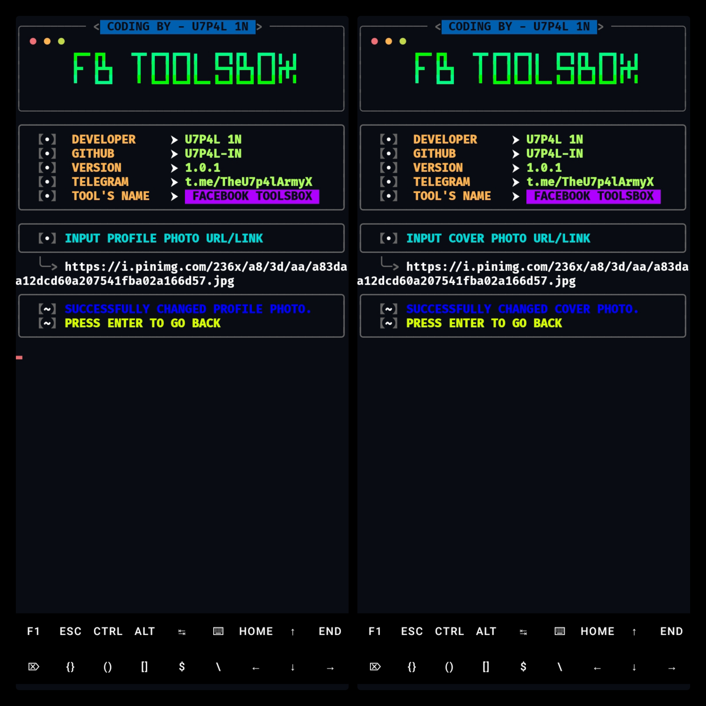 

## Profile Guard & Bio>
<p align="center";>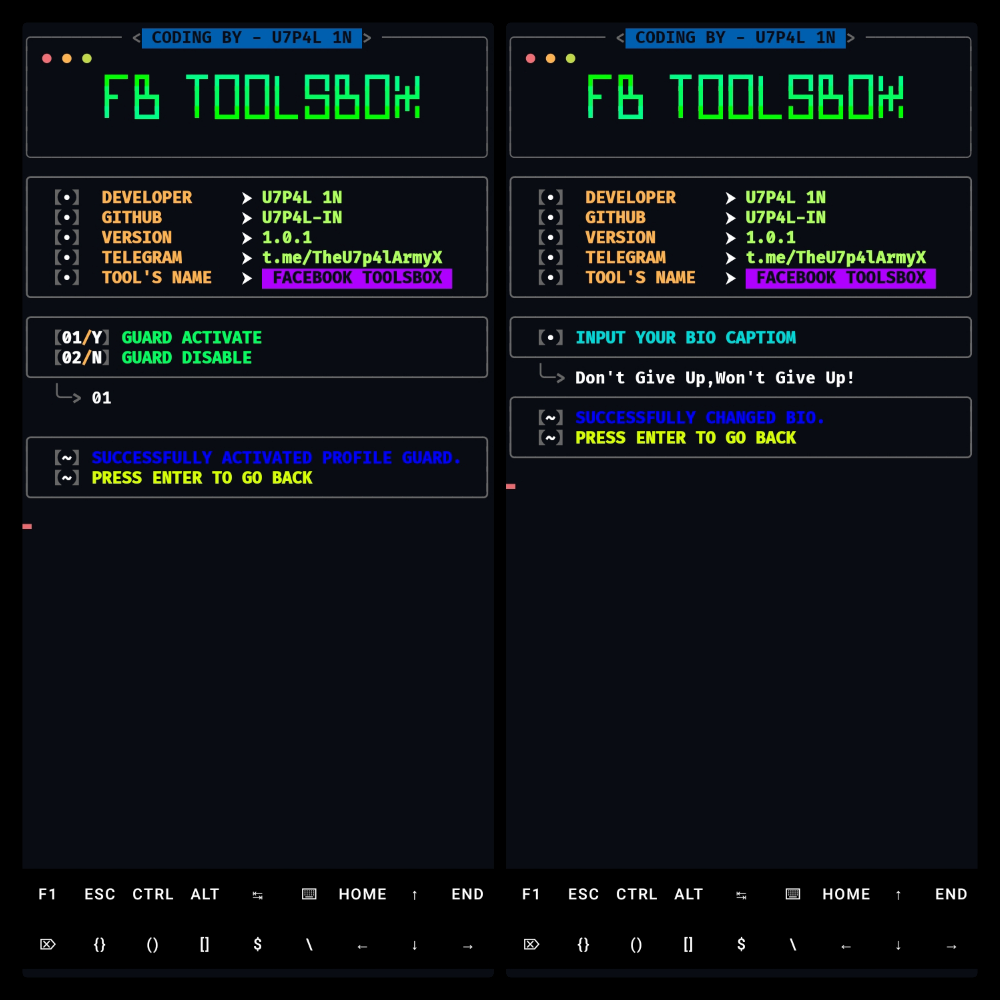 

## Change Website or City >
<p align="center";>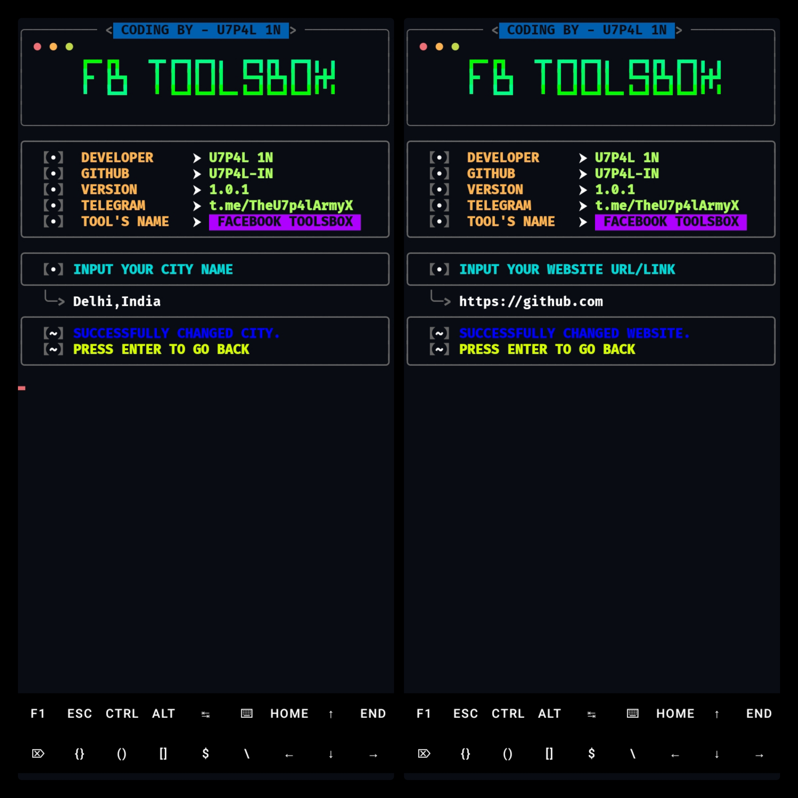 

## Lock Profile and Logout > 
<p align="center";>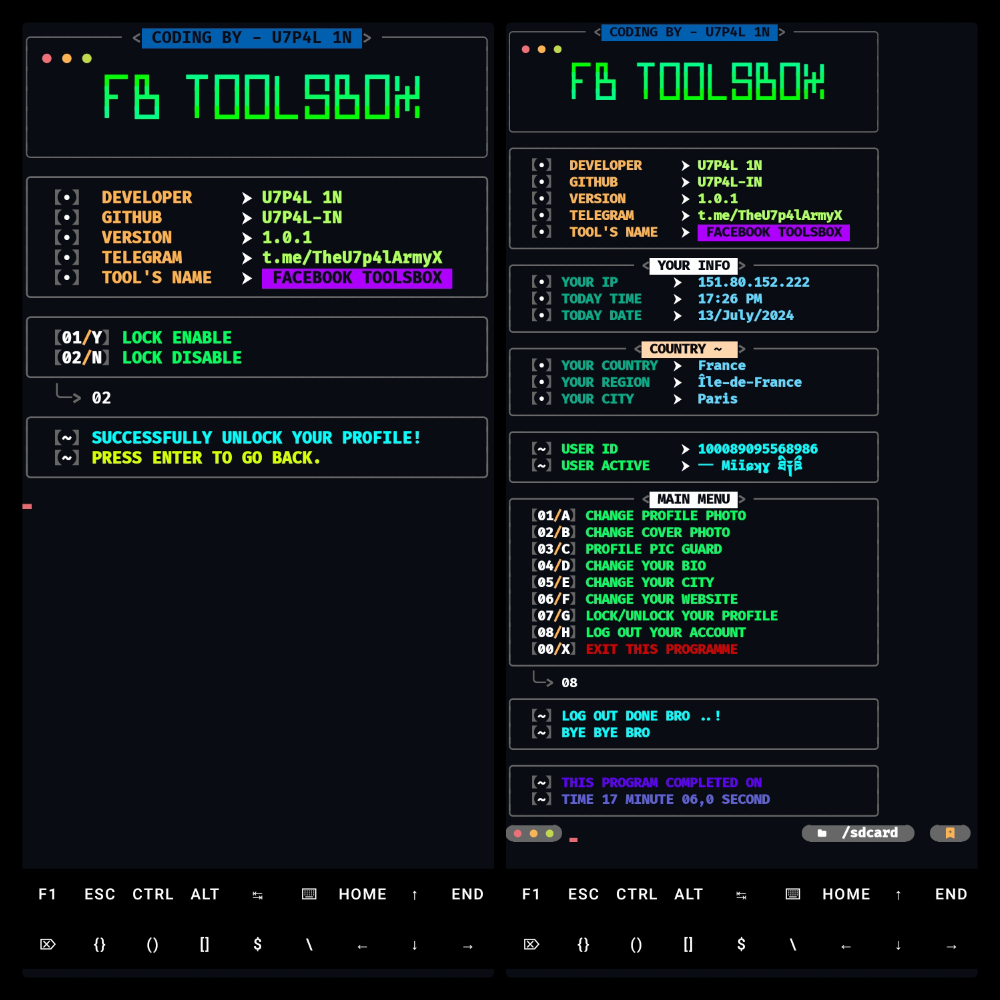 

# Report bugs
If you notice issues while installing this tool or running this tool kindly mail to me at <a href="mailto: lisame0007@gmail.com">Gmail</a> or Open an issue via github.

### Requirements 
```
python-3
pip
Internet Connection
And some other python packages
``` 
[Python 3](https://www.python.org/downloads/)

<hr>

<h2 align="left">Install Requirements (on Linux) > </h2><br>

```python
>> apt-get install git python3 python3-pip python python-pip
```
<h2 align="left">Kali Linux/Ubuntu/Parrot os > </h2><br>

```python
sudo apt-get update && apt-get install git
git clone https://github.com/U7P4L-IN/FB-TOOLSBOX.git
cd FB-TOOLSBOX
ls
sudo python3 fb.py
```
<h5 align="center"><b>KALI LINUX</b></h5>

<p align="center">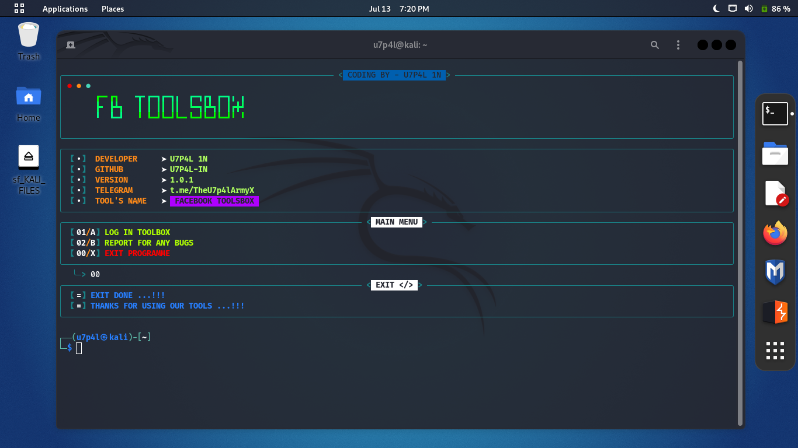
<p align="center">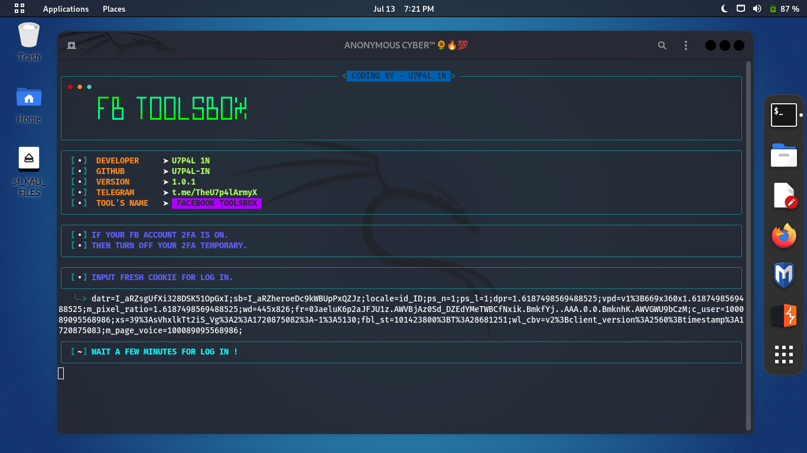
<p align="center">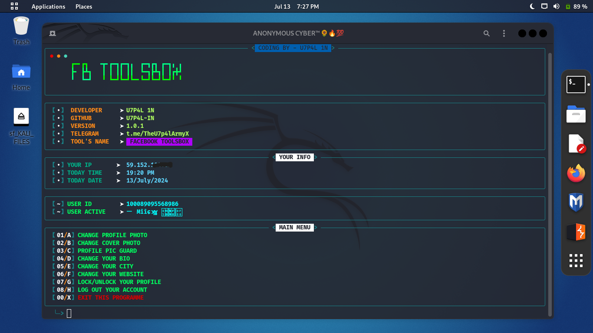
<p align="center">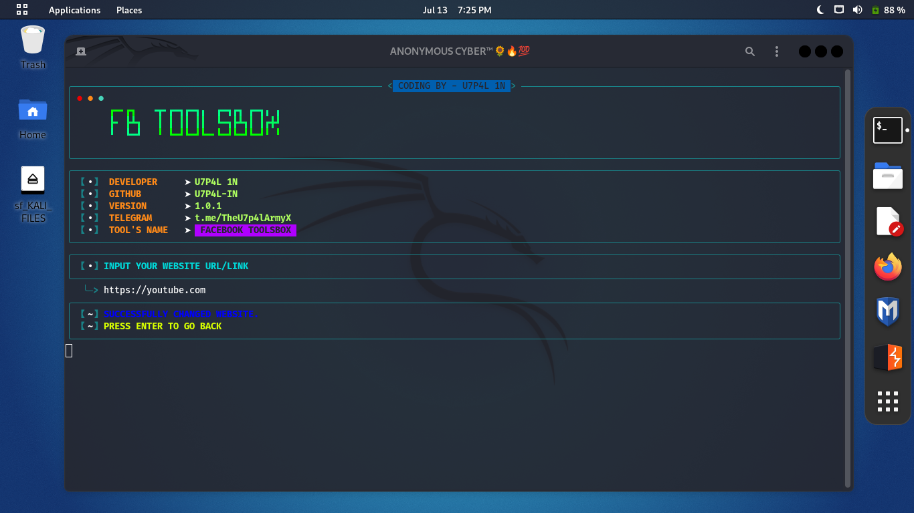
<p align="center">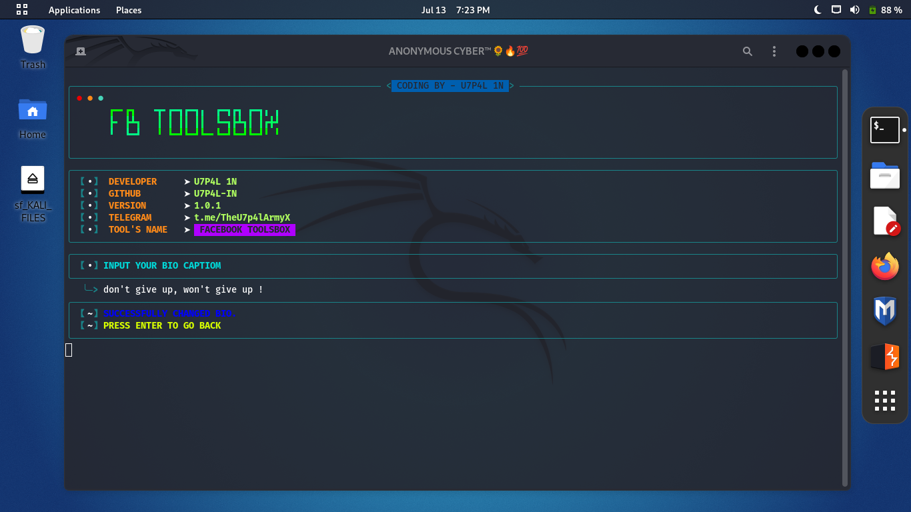
<p align="center">
    
</br>

<p align="center">  <a href="https://t.me/TheU7p4lArmyX"></a></p>

</br>

### Tools Languages :

<p align="center">

</p>

<br>

### No FB-TOOLSBOXs appearing?

- Doesn't work for cookies or new accounts!
- Maybe your Facebook account is checkpointed or locked.
- The Facebook system has been repaired causing failure to get FB-TOOLSBOXs.

### Why login failed?

- Your Facebook account cookies are no longer valid or expired.
- Your Facebook account is logged out of the browser.
- Maybe your Facebook account has been checkpointed or temporarily locked.


### Contributing
Feel Free To Clone This Project. For Major Changes, Please Open An Issue First To Discuss What You Would Like To Change Or Add, Thank You!!.

<h2 align="center">LICENSE</h2>

**FB-TOOLSBOX** converter is released under the MIT license, which grants the following permissions:
- Commercial use
- Modification
- Distribution
- Patent use
- Private use

For more convoluted language, see the [LICENSE](/LICENSE).
</br>

<h5 align="center"><b>DESCRIPTION</b></h5>

* ©️ Copyright Message
>> Copyright © [2023-27] [U7P4L-IN]
>All rights reserved. This Python project, along with its code, documentation, and any associated files, is the intellectual property of ANONYMOUS CYBER. You may not reproduce, distribute, or modify the contents of this repository without explicit permission from the owner.
# Give A Star ⭐
> You can also give this repository a star to show more people and they can use this repository.